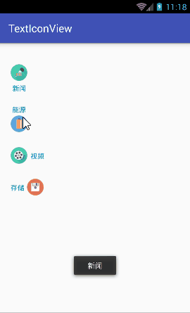
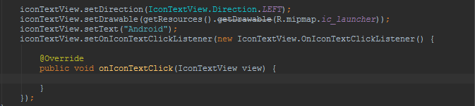

#简单的文字图标控件

##Usage
***

* 在xml布局文件中的使用方式：

		<LinearLayout xmlns:android="http://schemas.android.com/apk/res/android"
		          xmlns:app="http://schemas.android.com/apk/res-auto"
		          xmlns:tools="http://schemas.android.com/tools"
		          android:layout_width="match_parent"
		          android:layout_height="match_parent"
		          android:orientation="vertical"
		          android:paddingBottom="@dimen/activity_vertical_margin"
		          android:paddingLeft="@dimen/activity_horizontal_margin"
		          android:paddingRight="@dimen/activity_horizontal_margin"
		          android:paddingTop="@dimen/activity_vertical_margin"
		          tools:context="com.weiteng.demo.MainActivity">
		
		    <com.weiteng.widget.IconTextView
		        android:id="@+id/icon_tv"
		        android:layout_width="wrap_content"
		        android:layout_height="wrap_content"
		        android:layout_marginTop="20dp"
		        android:padding="4dp"
		        app:itv_direction="TOP"
		        app:itv_gap="6dp"
		        app:itv_icon="@mipmap/icon_news"
		        app:itv_text="新闻"
		        app:itv_textSize="13sp"/>
		
		</LinearLayout>

* java代码：
	

* 属性说明：
	* itv_direction： 图标的方向 TOP，上方；BOTTOM，下方；LEFT，左边；RIGHT，右边。
    * itv_gap： 图标和文字之间的间隙
    * itv_icon： 图标（暂时不支持 ShapeDrawable）
    * itv_text: 文本内容
    * itv_textSize： 字体大小
    * itv_iconWidth： 指定图标的宽度
    * itv_iconHeight： 指定图标的高度

